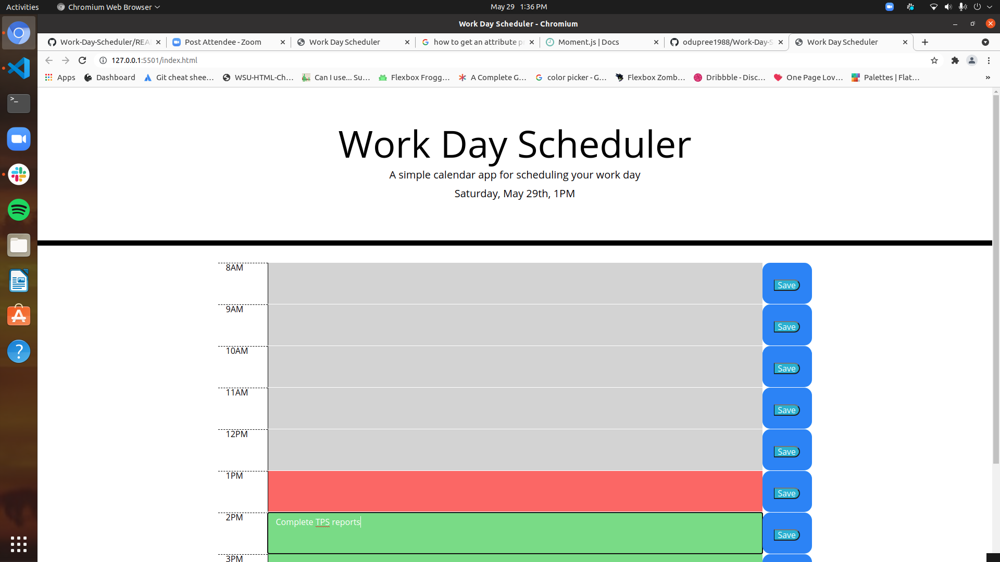
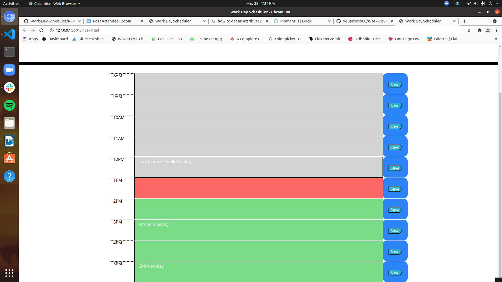

# Work-Day-Scheduler

## Purpose
* An tool used to help organize the work day. Allows users to enter tasks or reminders that update with color coded alerts throughout the day

## Built With
* HTML
* CSS
* JS

## Website
https://odupree1988.github.io/Work-Day-Scheduler/

## Contribution
Made by Owen Dupree
